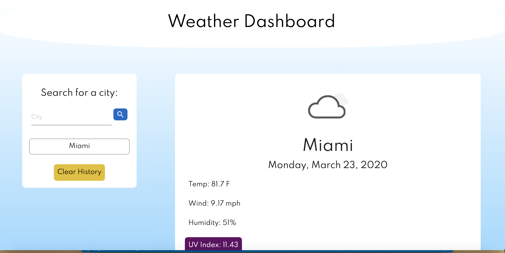
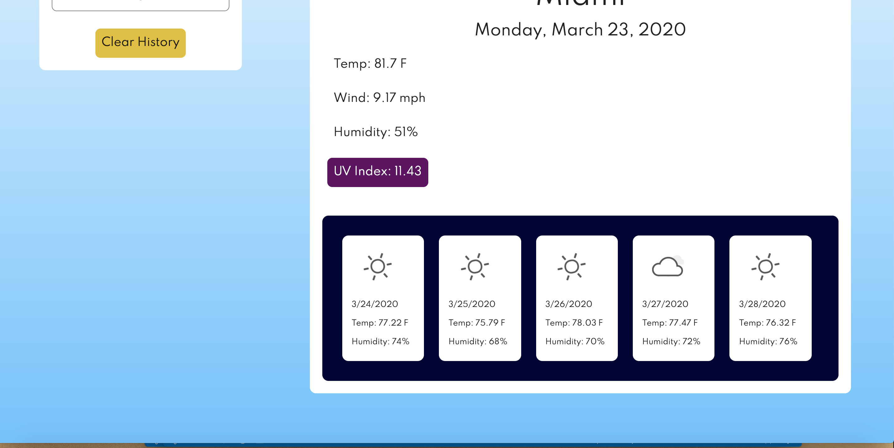

# Weather Dashboard

## Features

- Search for any city. 

- Today's weather information appears, along with a 5 day-forecast.

- UV Index background color changes by severity.

Severity      | Color
------------- | -------------
Low           | Green
Moderate      | Yellow
High          | Orange
Very High     | Red
Extreme       | Purple

- Animated icons reflect the weather.

- User's search history is saved in local storage, so the content persists upon refreshing the page.

-The user's search history is rendered in the div below the search bar, up to 10 entries, from most recent to oldest. To avoid redundance, user cities only appear once, moving to the top of the list after each search.

-Each entry in the search history is also a button. Once clicked, the information and forecast for that city is rendered. Also, that entry moves up to the top of the list.

- "Clear History" button empties local storage and clears the "Search History" div.

## UI 

## Tech Used / Dependencies

- Date and time info from: [Moment.js](https://moment.js.com/)

- Fonts from [Google Fonts](https://fonts.google.com/)

- Animated Icons from [Patharanordev](https://github.com/patharanordev/weather-icon-animated) 

- Animated Icons based on [WidgetWeather] (https://dribbble.com/shots/2097042-Widget-Weather)